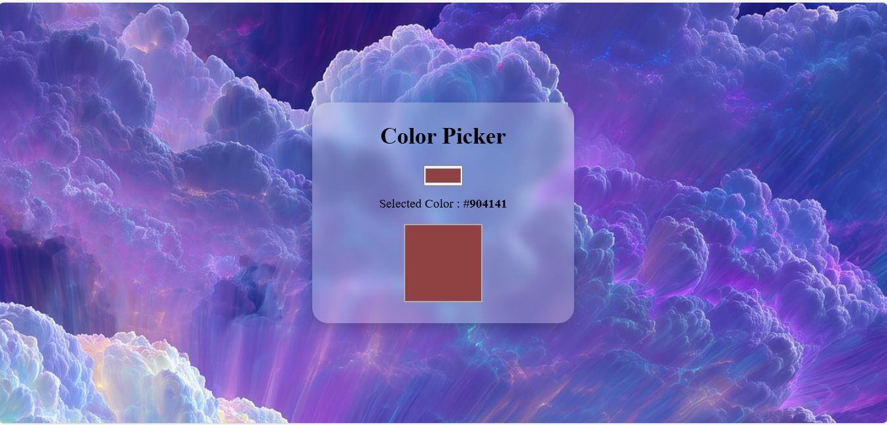

# Color Picker App

A simple and interactive **Color Picker** application built using **HTML, CSS, and JavaScript**.  
The app allows users to select any color using the color input field, and it visually displays the selected color along with its hex code.

---

## ✨ Features

- Pick any color using a built-in color input.
- Automatically displays the selected color code.
- Shows a live preview box filled with the chosen color.
- Clean, modern UI with background image and glass effect.
- Fully responsive using `rem`, `vh`, `vw`, and `%`.
- Smooth and simple user experience.

---

## 🛠️ Tech Stack

- **HTML5**
- **CSS3**
- **JavaScript (ES6)**

---
## 🧠 How It Works (Logic)

- When user selects a color, the `onchange` event triggers `colorChanger()`.
- JavaScript reads the hex color value:
  
  ```js
  let selectedColor = colorPicker.value;

---

## How to Run the Project
  
1. Download or clone the repository
2. Open the folder
3. Simply open **index.html** in any browser
4. No installation or server required

---

## Live Preview

(https://proj-color-picker.netlify.app/)

---

## 📸 Screenshot


---

## Author

Developed by **Ayesha Noor**.
Feel free to use, improve, or customize this project.

---

## License

This project is open-source and free to use for learning and practice.

---

If you like this project, consider giving the repo a ⭐ on GitHub!


